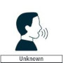

#						 [ Start - Page - 10 ]

 
 

Hello! What can I do for you?...

Hello, I'm here to see Ms. Moraltet?

Do you have an Appointment?

My name's Lya Berton.
I'm the new intern.

Oh, right! You came in last week to sign your contract!...

That's me!

Ms. Moraltet's in a meeting. Have a seat in the waiting room.

 

Do you need help?...

No, Thanks!... I'm fine...

    

I'll take care of everything... You can tell the board not to worry.

Not at all!. I'll let you sort out the details with Adéle. Goodbye!

Thank you.

   

Ma'am, Miss Berton is here...  
And so is your next client!...

 

Take Your Time!...

Hello, Miss Berton! A quick Meeting and then I'm all yours.

Adéle will give you a tour and show you your office.

Great!...

 
 
 

###			             [ Finish Page - 10 ]

---
[Go to next Page](https://github.com/batistasilva/Lya-Comic-book/blob/main/Page-11.md)
